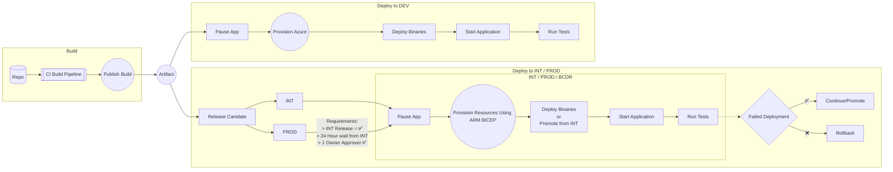

# Azure Infrastructure DevOps

This repository provides a structured approach to deploying and managing Azure infrastructure using DevOps best practices.



## Overview

- **Deployment Templates**: Infrastructure-as-Code (IaC) using Azure Bicep modules for modular, repeatable deployments.
- **Pipelines**: Generic YAML-based build and release pipelines for automated CI/CD.
- **Flowcharts**: Visual documentation of deployment and user flows.

## Repository Structure

```
DeploymentTemplates/
  AzureBicep/
    main.bicep
    environmentVariables.json
    modules/
      aksCluster.bicep
      apiGate.bicep
      apiManag.bicep
      azFD.bicep
      blob.bicep
      diag.bicep
      kv.bicep
      monitor.bicep
      redis.bicep
      sql.bicep
  Teraform/
Pipes/
  BuildPipe.yaml
  ReleasePipe.yaml
GenericFlowCharts/
  AzureHierarchy.md
  GenericDeploymentFlow.md
  GenericUserCloudFlow.md
```

## Getting Started

1. **Build Pipeline**: Use `Pipes/BuildPipe.yaml` to validate and compile Bicep templates.
2. **Release Pipeline**: Use `Pipes/ReleasePipe.yaml` to deploy compiled templates to Azure.
3. **Bicep Modules**: Customize and extend modules in `DeploymentTemplates/AzureBicep/modules/` as needed.

## Key Features

- Modular Bicep templates for scalable Azure deployments.
- Automated CI/CD with reusable pipeline definitions.
- Visual documentation for easy onboarding and understanding.

---

For more details, refer to the documentation in each folder or the flowcharts in `GenericFlowCharts/`.